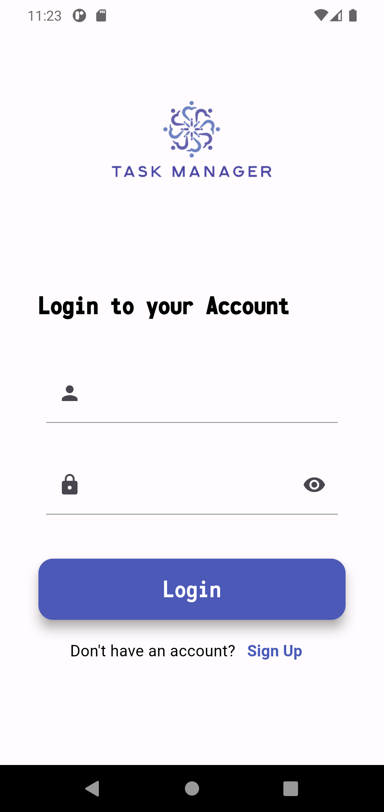
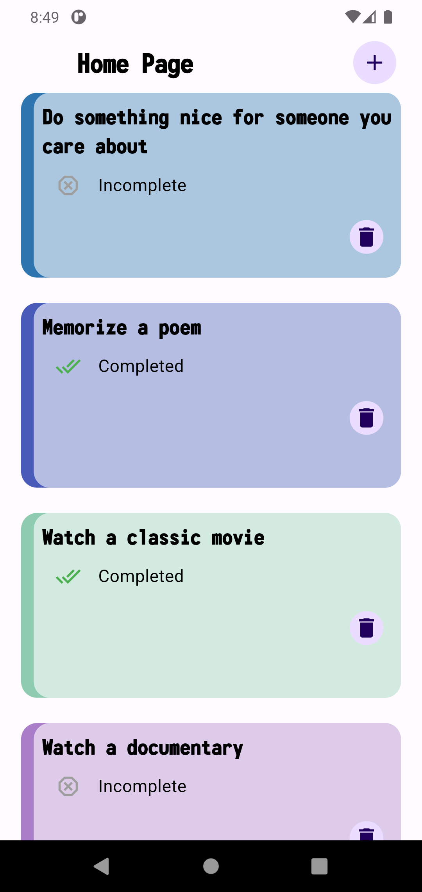
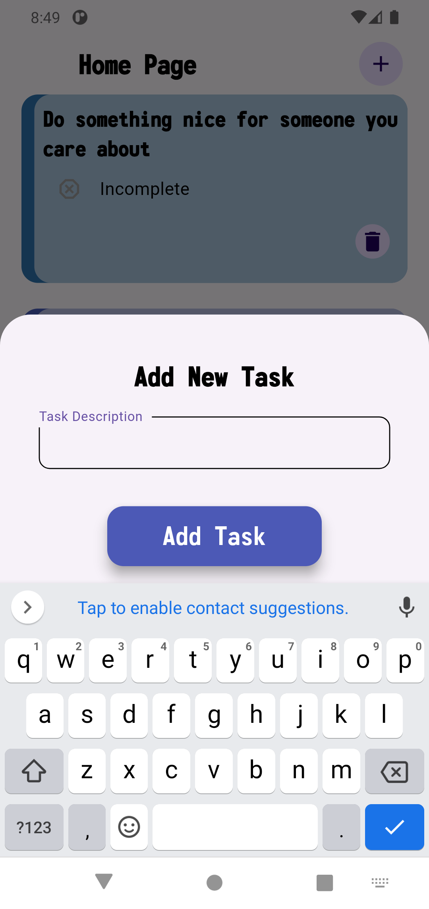

# Task Manager App

# Overview 

This is a Flutter-based task manager app that allows users to efficiently manage their tasks. The app includes user authentication, task management features, pagination for task retrieval, local storage for data persistence, and comprehensive unit tests to ensure functionality.

# Features

[User Authentication]: Secure login using username and password via Dummy JSON Auth API.

[Task Management]: Users can view, add, edit, and delete tasks utilizing the Dummy JSON Todos API.

[Pagination]: Efficiently fetch a large number of tasks with pagination using the endpoint: https://dummyjson.com/todos?limit=10&skip=10.

[State Management]: Implemented using GetX for efficient state management across the app.

[Local Storage]: Tasks are persisted locally using Shared Preferences to maintain accessibility even after app closure.

[Unit Tests]: Comprehensive unit tests cover CRUD operations, input validation, and network requests with mock responses.

# Screenshots

  
  
  

# Getting Started

Prerequisites
Flutter SDK
Dart
An IDE such as Android Studio or Visual Studio Code

Installation
Clone the repository:

git clone https://github.com/Belkees-alsayasinah/TaskManager.git

Navigate to the project directory:

cd task_manager_app

Install dependencies:

flutter pub get

Run the app:

flutter run

# Challenges Faced

- State Management Complexity: Implementing state management using GetX required a deeper understanding of the architecture and effective handling of state updates across multiple widgets.
- Pagination Implementation: Ensuring smooth pagination while maintaining performance was challenging, particularly with managing API requests and local data synchronization.
- Unit Testing: Writing comprehensive unit tests, especially for asynchronous operations and mock responses, posed a challenge in ensuring the coverage of all critical functionalities.

# Conclusion
This project demonstrates my proficiency in Flutter development, focusing on clean architecture, effective state management, and rigorous testing practices. Thank you for considering my application!

